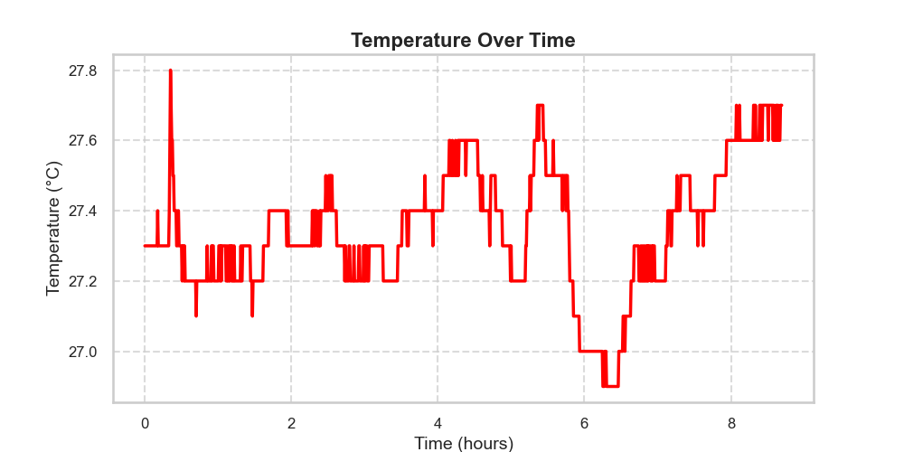
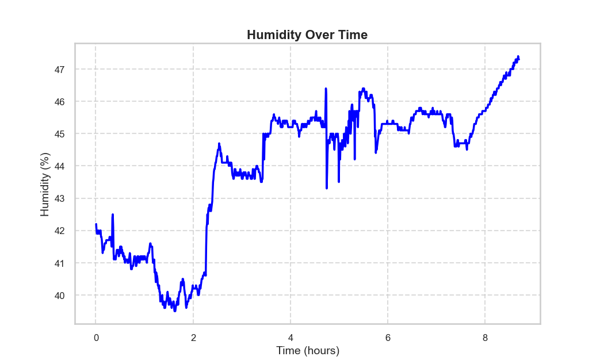

# DHT Sensor Data Analysis

## Folder Structure
```
logs/
│-- dht_log.txt   # Log file containing temperature and humidity data
│-- temperature.png  # Temperature vs Time graph
│-- humidity.png  # Humidity vs Time graph
│-- plot.py  # Python script for data visualization
│-- README.md  # This file
```
## Temperature and Humidity Graphs
### Temperature Over Time


### Humidity Over Time



## Requirements
Make sure you have the following Python libraries installed:
```sh
pip install matplotlib seaborn pandas
```

## Usage
Run the script to generate graphs:
```sh
python plot.py
```
This will generate `temperature.png` and `humidity.png` showing how temperature and humidity change over time.

## Output
- **temperature.png**: Shows temperature variations over time.
- **humidity.png**: Shows humidity variations over time.

## Summary Statistics
The script also prints basic statistics like mean, min, and max for temperature and humidity.

---

### Notes
- `dht_log.txt` should follow this format:
  ```
  Time : 10, Temp : 27.5, Hum : 45.3
  Time : 20, Temp : 27.6, Hum : 45.5
  ```
- If the time resets to 0, the script adjusts for discontinuities.

